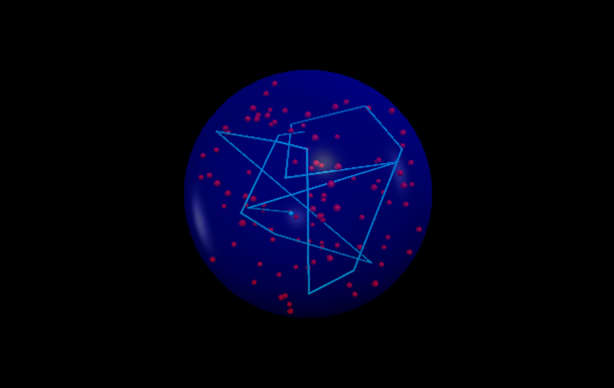
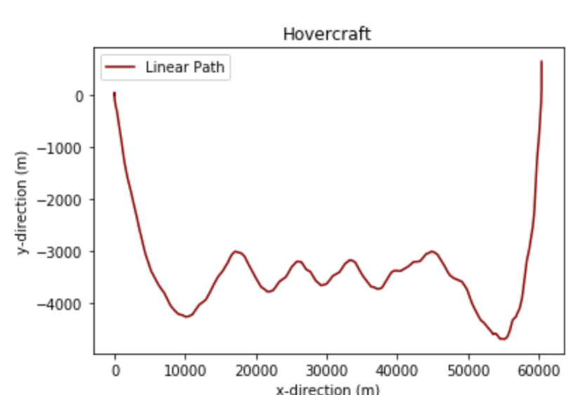
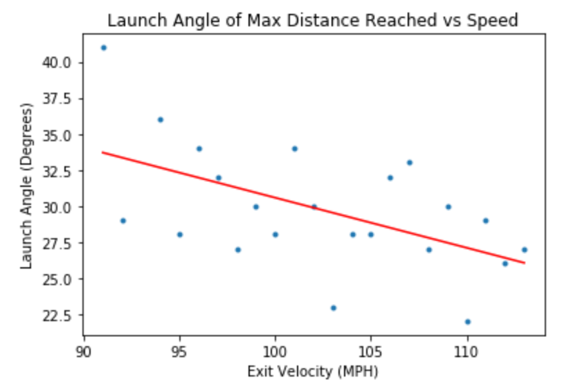
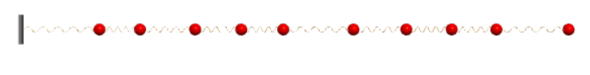
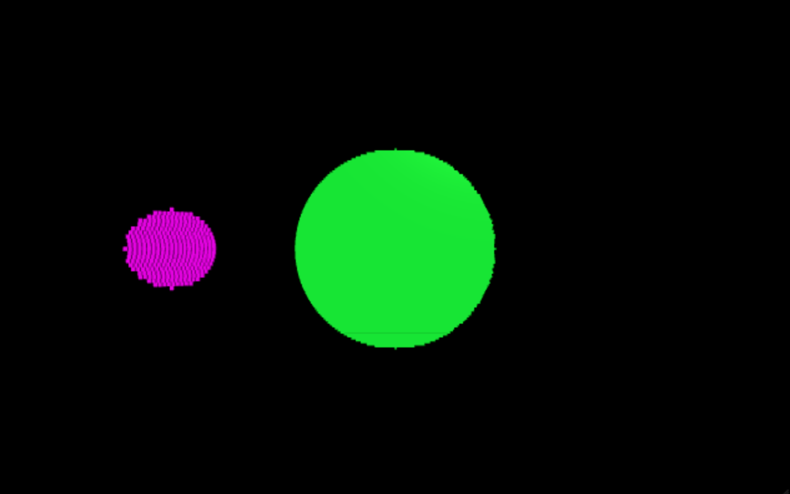

# Project Portfolio - Computational Physics

## Introduction
This portfolio showcases all of the computational physics projects Holden Harrington completed at High Point University in the spring semester of 2022.  These projects cover a range of topics, from modeling the motion of a makeshift hovercraft made by a few students to modeling an eclipsing binary star system.  As different as these projects may be, they all incorporate fundamental physics principles that allow for accurate models.  The theoretical physics involved in these projects is set at an undergraduate level, making it accessible to anyone with a background in a science field.  The Python notebooks provide comprehensive background information, elucidating the laws, methods, and assumptions utilized in crafting the programs, ensuring that individuals can easily follow along.

## Projects
The following gives a brief overview of each project with the links to their respective Jupyter Notebook.

* [Helium Atoms Inside a Latex Balloon](https://github.com/HPUPhysics-PHY2200-S22/00-project-Holden-Harrington.git) - To begin, the first project involves modeling helium atoms inside a latex balloon.  The helium atoms collide with each another and the balloon, creating elastic collisions until the atoms escape the balloon.  This is challenging as the student has to account for the gaps between the latex balloon in order to let the helium atoms escape slowly.

  

* [Path of a hovercraft](https://github.com/HPUPhysics-PHY2200-S22/01-project-Holden-Harrington.git) -  This project models a makeshift hovercraft that had angular and translational force exerted onto it by a vertical leaf blower.  It is exciting for the student as he had volunteered at a science exposition for community outreach for their university, called HPUinverse day, where he gave kids rides on said makeshift hovercrafts. The study reveals that the movement of the hovercraft was dependent on its radius through rotational displacement and angular velocity calculations.

  

* [MLB Home Runs](https://github.com/HPUPhysics-PHY2200-S22/02-project-Holden-Harrington.git) - The third project analyzes real home run derby data from mlb.com to explore whether or not there is an ideal launch angle to reach a maximum distance, equating to more home run hits.  Using exit velocities with their corresponding distances travelled and their launch angle provides insight to whether there is a correlation.

  

* [Coupled Oscillators](<https://github.com/HPUPhysics-PHY2200-S22/03-project-Holden-Harrington.git>) - The fourth project models coupled oscillators with one end bound and the other end bound or free.  This simulation demonstrates how the movement of masses affects each other when linked together by a chain.  When dealing with an interconnected system like this, numerical integration becomes a valuable technique for solving the system's differential equations.  However, challenges arise when multiple systems are coupled together, leading to issues like prolonged computing time and insufficient computing power.  The solution here is to use linear algebra to simplify the computational cost, specifically the SciPy linear algebra package.

  

* [Eclipsing Binary Star System](<https://github.com/Holden-Harrington/Final_Portfolio_Computational_Physics/blob/main/04-Project-Holden_Harrington.ipynb>) - The fifth and final project involves modeling a light curve of an eclipsing binary star system.  The idea is to simulate a star orbitting a stationary star and calculate how much area was being covered by the other star.  This is attempted through a method called tiling.  Tiling is simply breaking the object into a bunch of small boxes.  These boxes made up the star, and the areas covered are compared by evaluating the location of the center masses of the tiles for each star.

  

## Citations and Acknowledgements
* Dr. Aaron Titus, Professor of Physics and Astronomy, High Point University
* Wang, Jianyi Jay. Computational Modeling and Visualization of Physical Systems with Python. Wiley, 2016
